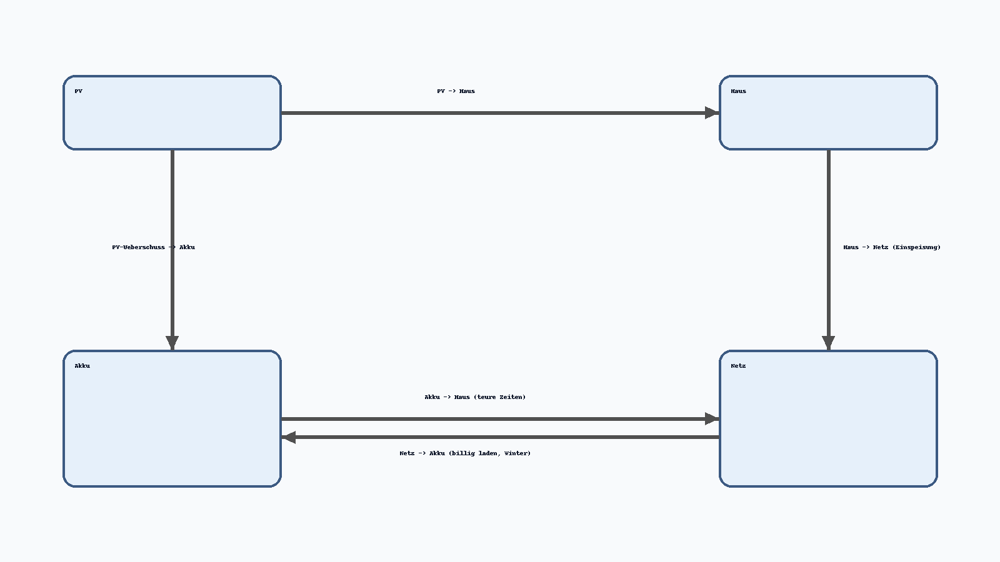

# Zendure & Home Assistant – Komplettanleitung
PV-Priorität, Winter-Preislogik, Manuell-Override, geplante Entladung, Debug & Dashboard.



---

## 1) Ziel & Überblick
- PV-Überschuss hat Vorrang: Überschuss wird stets in den Akku geladen (bis SoC-Ziel), Einspeisung erst danach.
- Winter-Optimierung: Zusätzliches Netzladen in billigen Zeiten; Entladen nur in teuren Zeitfenstern.
- Manuell-Override: Modus „Manuell“ schaltet die Automatik ab.
- SoC-Schutz: Reserve (Min) & Ziel (Max) mit sanftem Tapering.
- Geplante Entladeleistung: Verfügbare kWh werden gezielt über die teuren Slots verteilt.
- Debug & Dashboard: Status-Text, Debug-Sensor, kompaktes Gauge-Panel, Flowchart.

---

## 2) Benötigte Entitäten (aus der Anlage)
- PV-Leistung: `sensor.sb2_5_1vl_40_401_pv_power`
- Hausverbrauch: `sensor.gesamtverbrauch`
- Einspeisung (optional): `sensor.einspeisung`
- Strompreis aktuell: `sensor.electricity_price_paul_schneider_strasse_39`
- Tibber-Prognose 15m: `sensor.strompreis_prognose_15min_paul_schneider_strasse_39`
- SoC: `sensor.solarflow_2400_ac_electric_level`
- Verfügbare Energie: `sensor.solarflow_2400_ac_available_kwh`
- Modus: `select.solarflow_2400_ac_ac_mode` (input/output)
- Lade-/Entlade-Limits: `number.solarflow_2400_ac_input_limit`, `number.solarflow_2400_ac_output_limit`
- PV-Ertrag täglich (kWh): `sensor.stromerzeugung_taglich`

---

## 3) Helper (Slider & Selector)
```yaml
input_number:
  zendure_max_ladeleistung:
    name: Max Ladeleistung
    unit_of_measurement: W
    min: 0
    max: 3000
    step: 50
    initial: 2000

  zendure_max_entladeleistung:
    name: Max Entladeleistung
    unit_of_measurement: W
    min: 0
    max: 1500
    step: 50
    initial: 600

  zendure_soc_reserve_min:
    name: SoC-Reserve (Min)
    unit_of_measurement: '%'
    min: 0
    max: 60
    step: 1
    initial: 20

  zendure_soc_ziel_max:
    name: SoC-Ziel (Max)
    unit_of_measurement: '%'
    min: 50
    max: 100
    step: 1
    initial: 95

input_select:
  solarflow_betriebsmodus:
    name: SolarFlow Betriebsmodus
    options:
      - Automatik
      - Sommer
      - Winter
      - Manuell
    icon: mdi:weather-sunny
```

---

## 4) Statistik-Sensor für PV-7-Tage-Mittel
```yaml
sensor:
  - platform: statistics
    name: PV 7-Tage Mittel
    entity_id: sensor.stromerzeugung_taglich
    state_characteristic: mean
    max_age:
      days: 7
```

---

## 5) Automatische Sommer/Winter-Erkennung (bei Automatik)
```yaml
template:
  - binary_sensor:
      - name: solarflow_auto_sommer_winter
        state: >
          
          
          
            off
          
            
              on   {# Sommer #}
            
              off  {# Winter #}
            
              {{ is_state('binary_sensor.solarflow_auto_sommer_winter','on') }}
            
          
```

---

## 6) Template-Sensoren

### 6.1 PV-Überschuss
```yaml
template:
  - sensor:
      - name: pv_ueberschuss
        unit_of_measurement: "W"
        state: >
          
          
          {{ [pv - haus, 0] | max | round(0) }}
```

### 6.2 Empfehlungssensor V3 (PV-Priorität + Winter-Preislogik + Manuell)
```yaml
template:
  - sensor:
      - name: zendure_akku_steuerungsempfehlung_v3
        unique_id: zendure_akku_steuerungsempfehlung_v3
        state: >
          
          
          
          
          
          
          
          

          
          
          
          
          
          
            
            
          
            
            
          

          

          
            manuell
          
            
          
            
          

          
            
              billig_laden
            
              laden
            
              standby
            
          
            standby
          
            
              laden
            
              standby
            
              
                billig_laden
              
                entladen
              
                standby
              
            
              standby
            
          
```

### 6.3 Geplante Entladeleistung
```yaml
template:
  - sensor:
      - name: "zendure_geplante_entladeleistung"
        unit_of_measurement: "W"
        state: >
          
          
          
          
          
          
          
            0
          
            
            
            
            
            
              
                
              
            
            
              0
            
              
              
              {{ (avg_kw * 1000) | round(0) }}
            
          
```

### 6.4 Debug-Sensor (Klartext)
```yaml
template:
  - sensor:
      - name: "zendure_entlade_debug"
        icon: mdi:script-text-outline
        state: >
          
          
          
          
          
          
          
          

          
          
          
          
          
          

          
            
            
            
            
            
            
              
                
              
            
          
            
            
            
          

          
            Akku ist unter der Reserve. Kein Entladen.
          
            Keine teuren Zeitfenster erkannt → keine geplante Entladung.
          
            EXTREMER Preispeak ({{price}} €/kWh) → maximale Entladung (bis Hausbedarf oder {{max_out}} W).
          
            Geplante smarte Entladung aktiv:
            - verfügbare Energie: {{available}} kWh
            - teure Slots: {{slots}}
            - durchschnittliche Ziel-Leistung: {{planned|round(0)}} W
            - aktueller Preis: {{price}} €/kWh
            - Hausbedarf: {{netto|round(0)}} W
            - max möglich: {{max_out}} W
          
```

### 6.5 Status-Text
```yaml
template:
  - sensor:
      - name: "zendure_status_text"
        icon: mdi:information-outline
        state: >
          
          
          
          
          
          
          
          
          
          
          

          
            Akku auf Reserve ({{ soc|round(1) }} %)
          
            Akku voll ({{ soc|round(1) }} %)
          
            
              
                Netz-Laden ({{ in_lim|round(0) }} W) – Preis {{ price|round(2) }} €/kWh
              
                PV-Laden ({{ in_lim|round(0) }} W), Überschuss {{ surplus|round(0) }} W
              
            
              Entladen ({{ out_lim|round(0) }} W) – Preis {{ price|round(2) }} €/kWh
            
              Standby ({{ soc|round(1) }} %)
            
          
```

---

## 7) Haupt-Automation V3 (PV-Priorität, Preislogik, SoC-Taper)
```yaml
alias: "Zendure Akku Automatik V3"
description: "PV-Priorität, Winter-Preislogik, SoC-Guards, geplante Entladung, 0W-Stop"
mode: single
trigger:
  - platform: state
    entity_id: sensor.zendure_akku_steuerungsempfehlung_v3
condition:
  - condition: template
    value_template: "{{ trigger.to_state.state != 'manuell' }}"
action:
  - variables:
      soc: "{{ states('sensor.solarflow_2400_ac_electric_level') | float(0) }}"
      soc_min: "{{ states('input_number.zendure_soc_reserve_min') | float(20) }}"
      soc_max: "{{ states('input_number.zendure_soc_ziel_max') | float(95) }}"
  - choose:
      - conditions: "{{ trigger.to_state.state in ['laden','billig_laden'] and soc < soc_max }}"
        sequence:
          - service: select.select_option
            target: { entity_id: select.solarflow_2400_ac_ac_mode }
            data: { option: "input" }
          - variables:
              _max_charge: "{{ states('input_number.zendure_max_ladeleistung') | float(2000) }}"
              _pv: "{{ states('sensor.sb2_5_1vl_40_401_pv_power') | float(0) }}"
              _haus: "{{ states('sensor.gesamtverbrauch') | float(0) }}"
              _surplus: "{{ [_pv - _haus, 0] | max }}"
              _is_billig: "{{ trigger.to_state.state == 'billig_laden' }}"
              _charge_limit_base: >
                
                  {{ _max_charge }}
                
                  {{ [_surplus, _max_charge] | min }}
                
              _taper: >
                
                
                 0
                 1
                 {{ rem / span }}
                
              _charge_limit: "{{ (_charge_limit_base * _taper) | float(0) }}"
          - service: number.set_value
            target: { entity_id: number.solarflow_2400_ac_input_limit }
            data: { value: "{{ [_charge_limit, 0] | max | round(0) }}" }
          - service: number.set_value
            target: { entity_id: number.solarflow_2400_ac_output_limit }
            data: { value: 0 }
      - conditions: "{{ trigger.to_state.state == 'entladen' and soc > soc_min }}"
        sequence:
          - service: select.select_option
            target: { entity_id: select.solarflow_2400_ac_ac_mode }
            data: { option: "output" }
          - variables:
              _max_discharge: "{{ states('input_number.zendure_max_entladeleistung') | float(600) }}"
              _haus: "{{ states('sensor.gesamtverbrauch') | float(0) }}"
              _pv: "{{ states('sensor.sb2_5_1vl_40_401_pv_power') | float(0) }}"
              _netto: "{{ [_haus - _pv, 0] | max }}"
              _planned: "{{ states('sensor.zendure_geplante_entladeleistung') | float(0) }}"
              _price: "{{ states('sensor.electricity_price_paul_schneider_strasse_39') | float(0) }}"
              _very_expensive: 0.50
              _output_base: >
                
                {{ [_netto, cap, _max_discharge] | min }}
              _output_base_peaked: >
                
                  {{ [_netto, _max_discharge] | min }}
                
                  {{ _output_base }}
                
              _taper: >
                
                
                 0
                 1
                 {{ over / span }}
                
              _output_limit: "{{ (_output_base_peaked * _taper) | float(0) }}"
          - service: number.set_value
            target: { entity_id: number.solarflow_2400_ac_output_limit }
            data: { value: "{{ [_output_limit, 0] | max | round(0) }}" }
          - service: number.set_value
            target: { entity_id: number.solarflow_2400_ac_input_limit }
            data: { value: 0 }
      - conditions: >
          {{ trigger.to_state.state == 'standby'
             or (trigger.to_state.state in ['laden','billig_laden'] and soc >= soc_max)
             or (trigger.to_state.state == 'entladen' and soc <= soc_min) }}
        sequence:
          - choose:
              - conditions: "{{ is_state('select.solarflow_2400_ac_ac_mode','input') }}"
                sequence:
                  - service: number.set_value
                    target: { entity_id: number.solarflow_2400_ac_input_limit }
                    data: { value: 0 }
          - choose:
              - conditions: "{{ is_state('select.solarflow_2400_ac_ac_mode','output') }}"
                sequence:
                  - service: number.set_value
                    target: { entity_id: number.solarflow_2400_ac_output_limit }
                    data: { value: 0 }
```

---

## 8) Dashboard – Kompaktes Gauges-Panel
```yaml
type: vertical-stack
title: Zendure Akku
cards:
  - type: glance
    title: Status
    show_name: true
    show_icon: true
    show_state: true
    entities:
      - sensor.zendure_status_text
      - sensor.zendure_akku_steuerungsempfehlung_v3
      - select.solarflow_2400_ac_ac_mode
    state_color: false
  - type: horizontal-stack
    cards:
      - type: gauge
        name: Laden
        entity: number.solarflow_2400_ac_input_limit
        unit: W
        min: 0
        max: 2000
        severity:
          green: 200
          yellow: 1000
          red: 1500
      - type: gauge
        name: Entladen
        entity: number.solarflow_2400_ac_output_limit
        unit: W
        min: 0
        max: 600
        severity:
          green: 0
          yellow: 300
          red: 600
  - type: horizontal-stack
    cards:
      - type: gauge
        name: PV-Überschuss
        entity: sensor.pv_ueberschuss
        unit: W
        min: 0
        max: 3000
        severity:
          green: 300
          yellow: 1500
          red: 2500
      - type: gauge
        name: Strompreis
        entity: sensor.electricity_price_paul_schneider_strasse_39
        unit: €/kWh
        min: 0
        max: 0.8
        severity:
          green: 0.25
          yellow: 0.5
          red: 0.65
```

---

## 9) Energieflüsse (Klartext)
- PV → Haus: Grundlast decken.
- PV-Überschuss → Akku: bis SoC-Ziel.
- Billigpreis (Winter) → Netz → Akku: mit Slider-Limit.
- Teuerpreis (Winter) → Akku → Haus: bis SoC-Reserve, begrenzt durch Hausbedarf & Slider.
- Standby: beide Limits 0 W.
- Manuell: Automatik deaktiviert.

---

## 10) Checkliste Neuaufbau
1. Helper anlegen (Slider + Betriebsmodus).
2. PV-7-Tage-Mittel (statistics) hinzufügen.
3. Auto Sommer/Winter (binary_sensor) erstellen.
4. Template-Sensoren: Überschuss, Empfehlung V3, geplante Entladung, Status, Debug.
5. Automation V3 importieren.
6. Dashboard-Karten hinzufügen.
7. Test: Betriebsmodus auf „Automatik“, Werte beobachten.

---

## 11) Fehlerbehebung
- Keine Reaktion? „Letzte Auslösung“ der Automation prüfen und ob `sensor.zendure_akku_steuerungsempfehlung_v3` seinen Zustand ändert.
- Kein Laden bei Sonne? `pv_ueberschuss > 80 W`, SoC < Ziel?
- Modus input/output stimmt nicht? `select.solarflow_2400_ac_ac_mode` prüfen.
- Peaks nicht genutzt? Preis-Sensor und Prognose-Entitäten prüfen.
